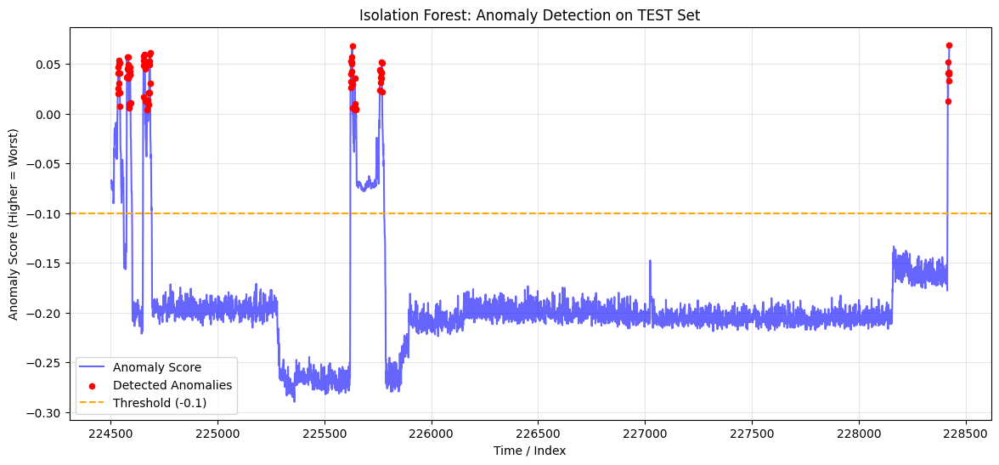

# Industrial Anomaly Detection on Run-to-Failure Sensor Data

Unsupervised anomaly detection on multivariate time-series data from
industrial machinery, with an emphasis on experimental design choices
that make results credible under real deployment constraints.

---

## Dataset

**Production Plant Data for Condition Monitoring**  
10 run-to-failure experiments, each recording multivariate sensor
readings over the full machine lifecycle. No failure labels are
provided — the task is purely unsupervised.

Source: https://www.kaggle.com/datasets/inIT-OWL/production-plant-data-for-condition-monitoring/data

---

## Experimental Design

### Data Split: Leave-Group-Out

Rather than random splitting, machines are treated as independent
groups. Files are assigned as follows:

| Split          | Files                                              |
|----------------|----------------------------------------------------|
| Train (8 runs) | C11, C13-1, C15, C16, C7-1, C7-2, C8, C9         |
| Validation     | C14                                                |
| Test           | C13-2                                              |

Within each training run, **only the first 70% of timesteps are used
for fitting**, preserving temporal ordering and preventing the model
from seeing degraded-state data during training. The validation and
test sets use the **complete run-to-failure cycle** for evaluation.
This mirrors the information available at deployment: only history up
to the current moment.

This design enforces two orthogonal generalization requirements:

- **Temporal integrity** — no look-ahead within a run
- **Machine independence** — no data leakage across machines

### Models

All three models are trained exclusively on normal-regime data
(one-class setting):

| Model | Rationale |
|---|---|
| **Isolation Forest** | Anomaly score from ensemble path lengths; no distance metric assumption |
| **kNN Distance** | Local density baseline; interpretable but sensitive to dimensionality |
| **One-Class SVM** | Kernel-based boundary; computationally expensive at scale |

---

## Results

### Isolation Forest on the Held-Out Machine

The anomaly score curve across the full test run shows elevated scores
at the start of the sequence (attributable to domain shift from an
unseen machine), a stable normal-regime period in the middle, and
renewed high scores toward the end consistent with the expected
failure phase. This matches the expected physics of wear-out failure
modes.



### Why Isolation Forest

Three properties make it the most suitable choice for this setting:

1. **Generalization under Leave-Group-Out** — scores remain stable
   across unseen machines, unlike kNN which is sensitive to local
   density shifts between machines.
2. **High-dimensional robustness** — path-length anomaly scores do not
   degrade with feature count; distance-based methods suffer from the
   curse of dimensionality.
3. **Score interpretability** — the continuous anomaly score encodes
   degradation severity, not just a binary flag, enabling
   threshold-free monitoring.

---

## Ablation & Stress Tests

### Sensor Importance (Feature Ablation)

Sensors were removed one at a time and model performance evaluated on
validation. **Sensor A_1** showed the highest individual contribution —
its removal caused the largest drop in anomaly score separation,
suggesting it captures the primary degradation signal. B_2 and A_5
follow in importance.

### Noise Robustness (5% Gaussian Noise Injection)

Gaussian noise (σ = 5% of each feature's range) was injected into the
test set. The global anomaly score shifted by **+0.0334** but the
temporal trend remained intact, indicating that the degradation
pattern is recoverable under realistic sensor noise.

### Failure Mode Clustering (K-Means, k=3)

K-Means clustering (k=3, determined by elbow method) was applied to
samples flagged as anomalous. The three clusters correspond to
qualitatively distinct sensor signatures, suggesting that the anomalous
regime is **not homogeneous** — different failure mechanisms may be
active at different stages.

---

## Project Structure

```
.
├── ProjectHoML.ipynb   # Full pipeline
├── figures/
│   └── isolation_forest_test.png
└── README.md
```

### Notebook Structure

The notebook is organized into the following sections:

1. Data loading & exploratory analysis
2. Leave-Group-Out split construction
3. Model training (Isolation Forest, kNN, One-Class SVM)
4. Evaluation & anomaly score visualization
5. Ablation: sensor importance, noise robustness, failure clustering

---

## Requirements

```bash
pip install numpy pandas scikit-learn matplotlib scipy
```

> **Note:** verify the full dependency list by running `pip freeze`
> after executing the notebook in a clean environment, as additional
> packages may be required.

### Running the Notebook

Execute cells sequentially from top to bottom. All sections are
self-contained within the notebook; no external scripts are required.

---

## Acknowledgements

Dataset: *Production Plant Data for Condition Monitoring*, inIT —
Institute Industrial IT, Kaggle.  
URL: https://www.kaggle.com/datasets/inIT-OWL/production-plant-data-for-condition-monitoring
